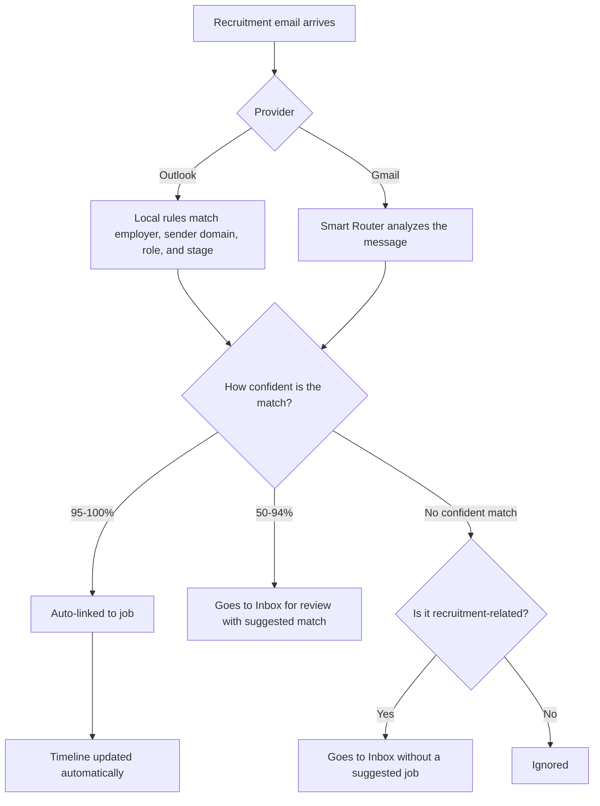

The Tracking Inbox reads job-application responses from Outlook or Gmail,
matches them to tracked jobs, and updates application timelines.


## Overview

1. Read recent messages from the connected inbox.
2. Match messages against applied and in-progress jobs.
3. Update the timeline when confidence is at least 95 percent.
4. Queue uncertain matches for your review.

## Smart router flow



## Setup

### Prerequisites

For Outlook Web, you need Peruz installed and an Outlook Mail tab signed in in
the local Chromium browser. JobOps doesn't need Microsoft Entra or Azure
credentials for this mode. Gmail still requires OAuth credentials.

### Configure OAuth

Set:

```bash
GMAIL_OAUTH_CLIENT_ID=your-client-id.apps.googleusercontent.com
GMAIL_OAUTH_CLIENT_SECRET=your-client-secret
GMAIL_OAUTH_REDIRECT_URI=https://your-domain.com/oauth/gmail/callback
```

For Outlook, open `https://outlook.live.com/mail/0/inbox` in the Peruz browser,
sign in yourself, select **Outlook Web (Peruz)** in **Tracking Inbox**, and
click **Connect**. Keep the Outlook tab open when you run **Sync**.

Detailed setup guide:

- [Gmail OAuth Setup](/docs/next/getting-started/gmail-oauth-setup)

## Using the inbox

- Review pending items in Tracking Inbox
- Approve to link/update timeline
- Ignore to mark non-relevant

## Job emails tab

Open **Job → Emails** to review captured messages already linked to that job.

The tab is read-only. It shows stored metadata only: sender, subject, received
time, snippet, processing status, message type, match confidence, account label,
and a provider link when the stored message includes one.

It does not store full email bodies, re-fetch from Gmail, or expose review
actions. Use **Tracking Inbox** for approve/ignore decisions.

Confidence interpretation:

- `95-100%`: auto-processed
- `50-94%`: pending review with suggestion
- `<50%`: pending review as orphan/ignored

## Privacy and security

The providers use separate privacy boundaries:

- Outlook Web uses the local Peruz browser bridge. It reads visible inbox rows
  from the already signed-in Outlook tab and doesn't store or receive your
  Microsoft password, browser cookies, or session headers.
- Gmail requests `https://www.googleapis.com/auth/gmail.readonly`.
- Outlook Web sync doesn't click, send, delete, or edit messages.
- Outlook stores the sender, subject, received time, body preview, routing
  result, and conversation identifier in your JobOps database. Outlook matching
  uses local rules and no LLM tokens.
- Gmail Smart Router behavior can send message content to your configured LLM
  provider for classification.
- JobOps doesn't store full Outlook message bodies.

## API reference

| Method | Endpoint                                  | Description           |
| ------ | ----------------------------------------- | --------------------- |
| GET    | `/api/post-application/inbox`             | List pending messages |
| POST   | `/api/post-application/inbox/:id/approve` | Approve message       |
| POST   | `/api/post-application/inbox/:id/deny`    | Ignore message        |
| GET    | `/api/post-application/runs`              | List sync runs        |
| GET    | `/api/jobs/:id/emails?limit=100`          | List job-linked email metadata |
| GET    | `/api/post-application/providers/gmail/oauth/start` | Start OAuth flow |
| POST   | `/api/post-application/providers/gmail/oauth/exchange` | Exchange OAuth code |
| GET    | `/api/post-application/providers/outlook/oauth/start` | Start Outlook OAuth flow |
| POST   | `/api/post-application/providers/outlook/oauth/exchange` | Exchange Outlook OAuth code |

## Common issues

- No refresh token: disconnect and reconnect Gmail.
- Outlook tab not found: open and sign in to Outlook Mail in the browser where
  Peruz is installed.
- Outlook messages not appearing: leave the inbox tab open with recent rows
  loaded, and run **Sync** again.
- Gmail emails not appearing: check runs, OAuth config, and recruitment
  subjects.
- Wrong matches: expected in lower-confidence buckets; use manual review.
